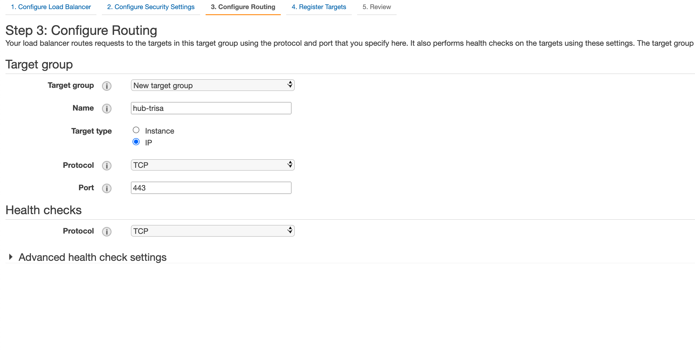

# Sygna Hub Document 


### How to launch Hub service in AWS

1. Make sure the domain of your service and get the issued cert(s) [ACM](https://docs.aws.amazon.com/acm/index.html) for the domain. 

2. Install docker engine and docker-compose
   * [Docker](https://docs.docker.com/engine/install/#server)
   * [Docker Compose](https://docs.docker.com/compose/install/)

3. Download [docker-compose.yml](docker-compose.yml) and [docker-compose.aws.override.yml](docker-compose.aws.override.yml) to your `./platform`, and customize `docker-compose.aws.override.yml` to fit your needs. If you changed the folder of files, you have to update settings `docker-compose.aws.override.yml` services:backend:environment:DB_HOST to match the auto-generated private DNS record (`postgres.{folder_name}.local`).

4. Create and switch into AWS context with docker CLI (https://docs.docker.com/cloud/ecs-integration/).

5. Execute the below command to launch containers in ECS

    ```
    docker-compose  -f docker-compose.yml  -f docker-compose.aws.override.yml up
    ```

6. Login to AWS and get the DNS name (like sygna-hub-XXXXX.ap-northeast-1.elb.amazonaws.com) of the ALB created.

7. Update DNS record to point the frontend/backend location into ALB DNS name in step 6.
### How to add trisa gateway service to Hub service in AWS
#### These steps could not be done by docker-compose up since Trisa gateway have to use a different load balancer and open multi ports.
0. Make sure you have full permission for following AWS services
    - IAM
    - EC2
    - ECS
    - ECR
1. Finish the previous section to start hub on AWS.

2. Get the IAM role arn of [backend service task-definiton](https://ap-northeast-1.console.aws.amazon.com/ecs/v2/task-definitions/platform-backend?status=ACTIVE&region=ap-northeast-1) (like arn:aws:iam::XXXXXX:role/platform-BackendTaskExecutionRole-XXXXX) created by docker-compose in AWS IAM from previous section.

3. Update [trisa.aws.taskdefinition.json](trisa.aws.taskdefinition.json) with IAM role arn  you got from step 2 and other parameters referenced in updated [docker-compose.aws.override.yml](docker-compose.aws.override.yml). The strings that need to be changed would be:
    - <DATA_ENCRYPTION_KEY> (same with docker-compose.aws.override.yml)
    - <POSTGRES_USER> (same with docker-compose.aws.override.yml)
    - <POSTGRES_PASSWORD> (same with docker-compose.aws.override.yml)
    - <IAM_ROLE_ARN_OF_PLATFORM_BACKEND> (get the IAM role ARN from step 2)

4. Register a new ECS task definition on [AWS-ECS Task definition](https://ap-northeast-1.console.aws.amazon.com/ecs/home?region=ap-northeast-1#/taskDefinitions) with updated [trisa.aws.taskdefinition.json](trisa.aws.taskdefinition.json) in step 2.
    - 

5. Create an `Network Load Balancer` to receive incoming tcp traffic going into trisa in [AWS EC2 console](https://ap-northeast-1.console.aws.amazon.com/ec2/home?region=ap-northeast-1#LoadBalancers:sort=loadBalancerName) , you can turn off the `New EC2 Experience` in web console to match following steps.
    1. The parameters to be set in Configure Load Balancer:
        - 
        - name: hub-trisa
        - Scheme: internet-facing
        - IP address type: ipv4
        - Load Balancer Protocol: TCP
        - Load Balancer Port: 443
        - VPC: same as hub settings, supposed to be default VPC and Availability Zones

    2. Ignore the Warning message of 'Improve your load balancer’s security. Your load balancer is not using any secure listener.' and click Next: Configure Routing
    
    3. The parameters to be set in Configure Routing:
        - 
        - Target group: New Target group
        - Name: hub-trisa
        - Target type: IP
        - Protocol: TCP
        - Port: 443

    4. Ignore Step 4: Register Targets and Create the Network Load Balancer and Target group
    5. (Optional) Change your DNS record of Trisa endpoint to point into this Network Load Balancer.

6. Create Trisa service
    1. Head into [ECS service console] (https://ap-northeast-1.console.aws.amazon.com/ecs/home?region=ap-northeast-1#/clusters/platform/services) created by the previous Phase.
    2. Turn off "New ECS Experience" since we need service discover utilities which are not supported yet.
        - 
    3. Finish "Step 1. Configure service" with the following parameters:
        - Launch type: fargate
        - Operating system family: Linux
        - Task Definition: platform-trisa (created by step 4.)
        - Revision: 1
        - Platform version: Latest
        - Cluster: platform
        - Service name: trisa 
        - Number of tasks: 1
        - Minimum healthy percent: 100
        - Maximum percent: 200
        - Deployment circuit breaker: Disabled
        - Deployment type: Rolling Updated 
    
    4. Finish "Step 2. Configure network" with following parameters
        - Cluster VPC: Same as hub backend service , supporse to be default VPC.
        - Subnets: Same as hub backend service
        - Security groups:  Same as hub backend service 
        - Auto-assign public IP: Enabled
        - Load balancer type: Network Load Balancer
        - Load balancer name: hub-trisa
        - Container name : port : trisa:443:443
        - Enable service discovery integration: checked , and following parameters will be popout.
        - Namespace: platform.local|PRIVATE
        - Configure service discovery service: Create new service discovery service
        - Service discovery name: trisa
        - Enable ECS task health propagation: checked
        - DNS record type: A
        - TTL: 60
    5. Ignore "Step 3: Set Auto Scaling (optional)" and "Step 4: Review" to Create the service.

    6. After the Status of trisa become  "ACTIVE", you can set up trisa settings from hub console. 

### Recommand production settings note for AWS 

 1. Use AWS RDS instead of ECS started database.
 2. Use Secret Manager for environment  variables instead fo plan text in task-definition.
 3. Increase backend and frontend task number for high availability.

